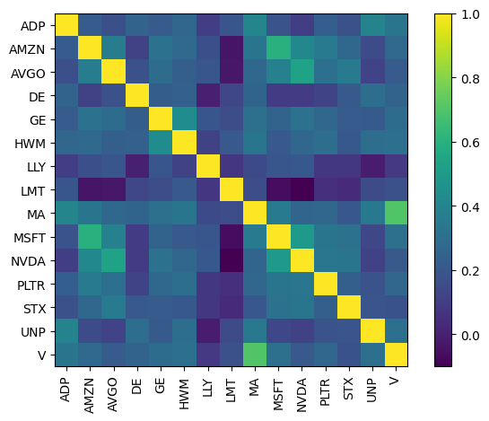
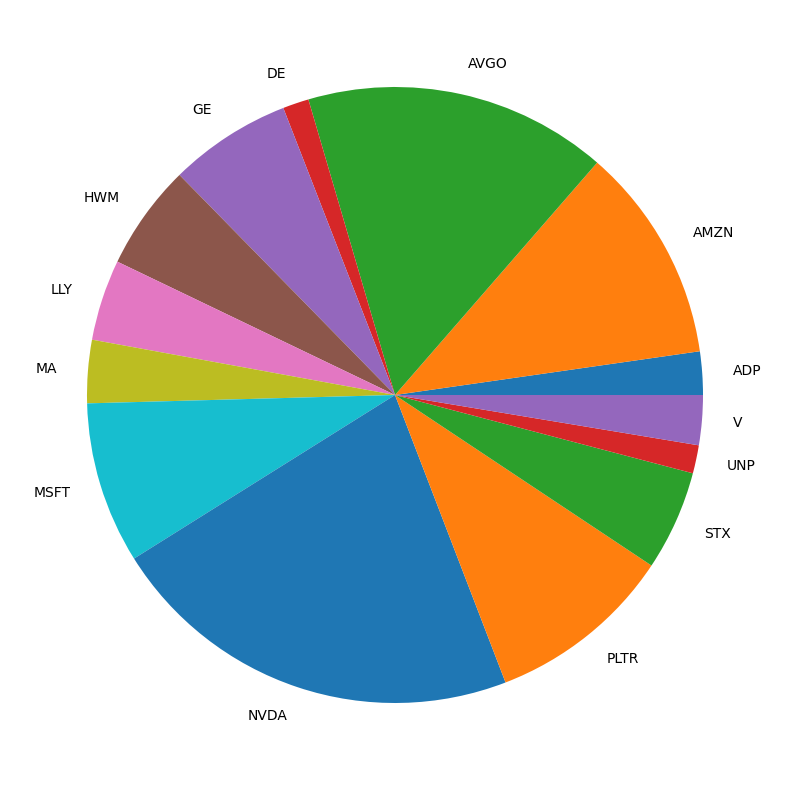

+++
date = '2025-12-04T18:20:00+01:00'
draft = false
title = 'Black Litterman Model'
+++




## Introduction
For my first project in the "Quant AI" space I started with one of the easier, but still somewhat challenging project of making a Black-Litterman model that would be able to show the best possible stock allocation based on the market data of the last few years.

## Laying the ground work
At first I started of the project getting back into the feeling of using python for data science purposes, since because of my previous study major I did not use python for this goal as much. Because of this I build the project step-by-step

### Methodology

#### Black-Litterman
The main part of this project for me was understanding the Black-Litterman model itself. It is a sophisticated portfolio allocation framework that improves upon standard Mean-Variance Optimization. Traditional optimization often yields extreme, unintuitive portfolios that are highly sensitive to input estimates. Black-Litterman solves this by using a Bayesian approach to combine two sources of information:

1.  **The Market Equilibrium (The Prior)**: It assumes the market is efficient and that the current market capitalization weights reflect the consensus expected returns. This provides a stable, neutral starting point.
2.  **Investor Views (The Likelihood)**: It allows the investor to express specific absolute or relative views on certain assets (e.g., "Tech will outperform Energy by 5%"), along with a confidence level for each view.

The formula below calculates the **Posterior Expected Returns** (Result of the Black-Litterman model), which is a weighted average of the market equilibrium and the investor's views:

$$
E(R) = \left[ (\tau \Sigma)^{-1} + P^{T} \Omega^{-1} P \right]^{-1} 
       \left[ (\tau \Sigma)^{-1} \Pi + P^{T} \Omega^{-1} Q \right]
$$

Where:

- \( E(R) \): \(N \times 1\) vector of posterior expected returns (number of assets = \(N\))
- \( Q \): \(K \times 1\) vector of views
- \( P \): \(K \times N\) picking matrix mapping views to assets
- \( \Omega \): \(K \times K\) diagonal covariance (uncertainty) matrix of views
- \( \Pi \): \(N \times 1\) vector of prior (equilibrium) expected returns
- \( \Sigma \): \(N \times N\) covariance matrix of asset returns
- \( \tau \): scalar tuning constant (reflecting uncertainty in the prior)

This gives us a good starting point for the code.


#### Python
For this project we will be making use of the [PyPortfolioOpt](https://pyportfolioopt.readthedocs.io/en/latest/index.html) module, this module will make the overal calculations a lot easier.
```python
from pypfopt import black_litterman, risk_models
from pypfopt import BlackLittermanModel, plotting
from pypfopt import EfficientFrontier, objective_functions
```

Then for the data I used the [yfinance](https://pypi.org/project/yfinance/) module, this module gives me easy access to all the market data based on tickers. As of tickers I choose:
```python
import yfinance as yf
```

As of tickers I choose
```python
tickers = ["MSFT", "AMZN", "NVDA", "LLY", "AVGO", "PLTR", "GE", "STX", "HWM", "UNP", "MA", "V", "ADP", "DE", "LMT"]
```

From this I retrieved the data and filtered the data to training data (up until this year) and test data (this year)
```python
data = yf.download(tickers + ['SPY'], period="3y")['Close']

current_year_mask = pd.to_datetime(data.index) > pd.to_datetime('2024-12-31')
training_data = data[~current_year_mask].loc[:, data.columns != 'SPY']
training_market_prices = data[~current_year_mask]['SPY']

current_year_data = data[current_year_mask].loc[:, data.columns != 'SPY']
current_year_spy = data[current_year_mask]['SPY']
```

Now we can start calculating, the first calculation we will do is find the covariance matrix for the stocks that we choose.
```python
S = risk_models.CovarianceShrinkage(training_data).ledoit_wolf()
```
The variance matrix we will shrink using Ledoit and Wolf proposed method in ["A well-conditioned estimator for large-dimensional covariance matrices"](https://www.sciencedirect.com/science/article/pii/S0047259X03000964)



After this we start calculating the market priors.
```python
delta = black_litterman.market_implied_risk_aversion(training_market_prices)

market_prior = black_litterman.market_implied_prior_returns(ticker_market_caps, delta, S)
```

Then the P Q and confidence levels
```python
ai_stocks = [0,1,2,4,5,7]

q = np.array([0.10]).reshape(-1,1)
p = np.array(
    [[1/6,1/6,1/6,-1/9,1/6,1/6,-1/9,1/6,-1/9,-1/9,-1/9,-1/9,-1/9,-1/9,-1/9]]
)

confidences = [0.4]
```
For this I used the current hype around AI stocks.

With this we were able to calculate the stock allocation proposed by the model
```python
ef = EfficientFrontier(post_returns_bl, bl.bl_cov())
ef.add_objective(objective_functions.L2_reg)
ef.max_sharpe()
weights = ef.clean_weights()
weights
pd.Series(weights).plot.pie(figsize=(10,10));
```


After this doing some backtesting of the S&P 500 (SPY) and my own portifolio, I got these results

With a Sharpe ratio of **0.8911** (vs SPY 0.86).
### Results
From this I can conclude that the first phase of the project was a success, the model was able to outperform the S&P 500. Although this does not mean that everyone should now invest in the portfolio I calculated, because my personal views were heavily based on what I know this year brought. But it does show the impact of being able to add your own views into the mix when determining how to allocate your portfolio.

## Everything needs AI
Now that the manual work has been done and I have an understanding of the subject, I wanted to add AI into the mix and let them compete against one another to see who would be able to best predict the market.

### Methodology
This part of the project took by far the longest. The goal was to create an autonomous agent capable of researching the market, selecting promising assets, and formulating mathematical views compatible with the Black-Litterman model.

I tested three different state-of-the-art models for this task:
- **GPT-5 mini** (OpenAI)
- **Qwen3** (Alibaba Cloud)
- **Grok 4.1 fast** (xAI)

To enable these models to perform quantitative analysis, I built a custom Python module (`llm_specialists`) that provides them with three specific tools:

1.  **Market Research Tool**: A connection to a locally hosted [SearXNG](https://github.com/searxng/searxng) instance. This allowed the models to query real-time news and sentiment data, overcoming their training data cutoffs.
2.  **Financial Data Tool**: A wrapper around `yfinance` that allowed the agents to request historical price data, calculate volatility, and check market caps for specific tickers.
3.  **P & Q Validator**: This was the most critical addition. The Black-Litterman model requires precise matrix dimensions for the views \(P\) and expected returns \(Q\). Early tests showed that LLMs struggle with these strict mathematical constraints (e.g., ensuring the weights in a view sum to 0 for relative views or 1 for absolute views). This tool validated their matrices and provided feedback, allowing the models to self-correct before finalizing their output.

The final output from each agent was a structured object containing their selected tickers, the view matrices (\(P\) and \(Q\)), their confidence levels in those views, and a reasoning string explaining their strategy.

### Results
This time I will not bore you with all the little steps but immediately show you the results of the great AI Stock trading portfolio allocation competition....

First of their allocations.


And now the backtesting results.


With sharpe ratios of:

```cli
-------------------------------------------------------
Model                      Return    Sharpe Ratio
-------------------------------------------------------
GPT-5 mini                 37.88%            1.14
Qwen3                      25.32%            0.82
Grok 4.1 fast              33.45%            0.96
-------------------------------------------------------
S&P 500                    18.09%            0.86
```

So in the end not that promising...

### Discussions
The results of this project were quite interesting. While the manual model performed exceptionally well, this was largely due to the fact that I had the benefit of hindsight when creating the views. I knew which sectors performed well in 2025, so my "views" were biased towards those winners.

The AI models, on the other hand, had to rely on their training data and the tools I provided. The fact that GPT-5 mini and Grok were able to outperform the S&P 500 is a testament to the potential of LLMs in financial analysis. They were able to identify promising sectors and allocate capital accordingly.

However, the struggle to get consistent P and Q matrices highlights a major challenge: LLMs are great at reasoning but can struggle with precise mathematical structuring without strict guidance. The need for a validation tool shows that we can't yet fully trust these models to operate autonomously in complex quantitative tasks.

In the future, I would like to expand on this by:
- Automating the view generation process further.
- Experimenting with more advanced agentic workflows.
- Possible fine-tuning of models to see if they can outperform general build models.